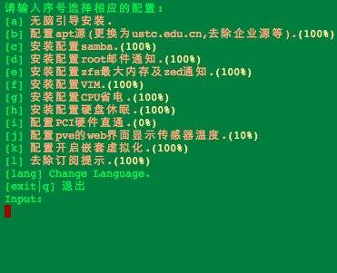
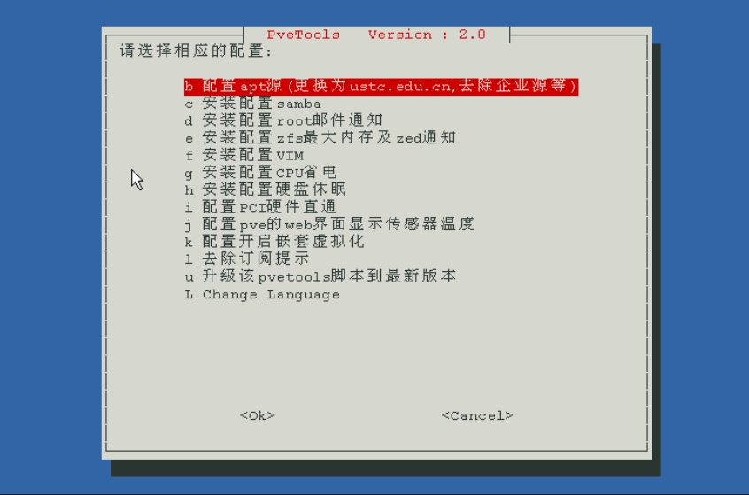
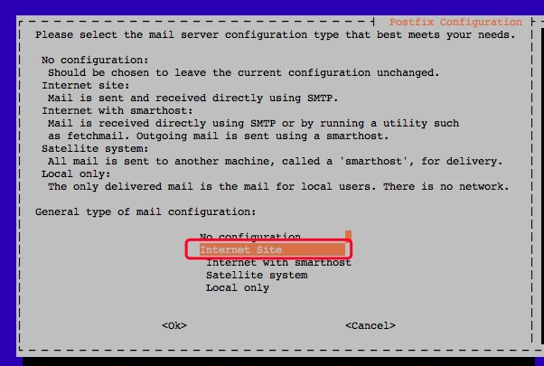

# pvetools
proxmox ve tools script(debian9+ can use it).Including install postfix samba and config set zfs max ram, nested virtualization etc.
for english user,please look the end of readme.

这是一个为proxmox ve写的工具脚本（理论上debian9+可以用）。包括配置邮件，samba,zfs，嵌套虚拟化等功能。


### 安装

##### 中国用户:

> 需要用root账号来运行

在终端中按行分别执行以下内容：

>pve6.0需要先删除企业源：`rm /etc/apt/sources.list.d/pve-enterprise.list`

```
export LC_ALL=en_US.UTF-8
apt update && apt -y install git && git clone https://github.com/ivanhao/pvetools.git
cd pvetools
./pvetools.sh
```
请按上面的方式来安装，不建议直接下载单sh脚本使用，因为那样更新的功能会无法使用！

### 卸载
1. 删除下载的pvetools目录


### 运行

在shell中进入pvetools目录，输入
`
./pvetools.sh
`
* 如果提示没有权限，输入`chmod +x ./*.sh`

### 主界面




根据需要选择对应的选项即可。

#### 配置邮件说明：

只有以下界面需要用tab键选成红框的内容,其他的一律无脑回车即可。



#### 如果这个脚本帮到你了，麻烦点一下右上角的star小星星^_^

## qq交流群: 878510703


## 如果觉得好的请捐赠一下^_^


感谢捐赠人员！

捐赠列表：

杨惠(来源qq)    


# [版本说明]
##### v2.0.4
发布时间：2019.11.06

new feature:
- 增加docker的web界面（portainer)
- 去除隐藏的命令输出，例如apt-get install的输出等。


##### v2.0.3
发布时间：2019.11.04

new feature:
- 增加qm set映射物理硬盘的功能


##### v2.0.2
发布时间：2019.11.01

new feature:
- 增加chroot功能，默认安装好Alpine
- 增加docker功能，默认安装在Alpine中
- bug修复

##### v2.0.1  
发布时间：2019.10.24

new feature:
- 增加显卡直通的支持


##### v2.0  
发布时间：2019.10.01

new feature:
- 界面修改为whiptail，交互性更好，不需要输入字母来选择
- bug修复

### install

##### for english user:

```
export LC_ALL=en_US.UTF-8
apt update && apt -y install git && git clone https://github.com/ivanhao/pvetools.git
cd pvetools
./pvetools.sh
```

### Uninstall 
1. delete pvetools folder


